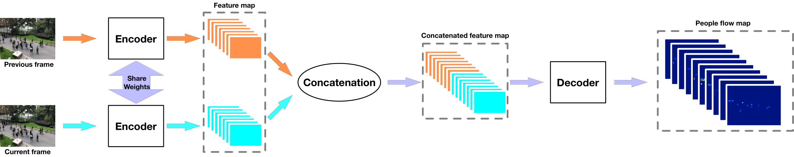
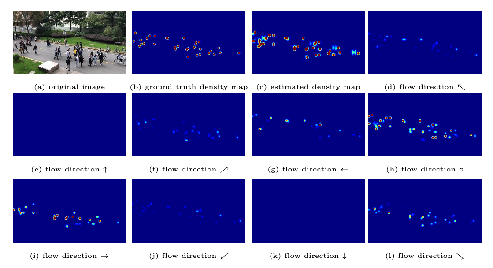

# Code for "Estimating People Flows to Better Count Them in Crowded Scenes" (ECCV 2020) and "Counting People by Estimating People Flows" (TPAMI 2021)

This repository is a PyTorch implementation for the paper **Estimating People Flows to Better Count Them in Crowded Scenes**. Weizhe Liu, Mathieu Salzmann, Pascal Fua. ECCV. 2020 and **Counting People by Estimating People Flows**. Weizhe Liu, Mathieu Salzmann, Pascal Fua. TPAMI. 2021. If you use this code in your research, please cite
[the conference paper](https://www.ecva.net/papers/eccv_2020/papers_ECCV/papers/123600715.pdf) and [the journal paper](https://arxiv.org/pdf/2012.00452.pdf).


Modern methods for counting people in crowded scenes rely
on deep networks to estimate people densities in individual images. As such, only very few take advantage of temporal consistency in video sequences, and those that do only impose weak smoothness constraints across consecutive frames.

In this paper, we advocate estimating people flows across image locations between consecutive images and inferring the people densities from these flows instead of directly regressing. This enables us to impose much stronger constraints encoding the conservation of the number of people.
As a result, it significantly boosts performance without requiring a more complex architecture. Furthermore, it also enables us to exploit the correlation between people flow and optical flow to further improve the results.


Figure 1: **Model Architecture:** Two consecutive RGB image frames are fed to the
same encoder network that relies on the CAN scale-aware feature extractor. These multi-scale features are further concatenated and fed to a decoder network to produce the final people flow maps.



Figure 2: **Density estimation in FDST.** People mostly move from left to right. The estimated people density map is close to the ground-truth one. It was obtained by summing the flows towards the 9 neighbors (b). They are denoted by the arrows and the circle. Strong flows occur in (g),(h), and (i), that is, moving left, moving right, or not having moved. Note that the latter does not mean that the people are static but only that they have not had time to change grid location between the two time instants.

## Installation
PyTorch 1.3.1

Python 3.7.4

## Dataset

&emsp;1. Download FDST Dataset from
Google Drive: [link](https://drive.google.com/drive/folders/19c2X529VTNjl3YL1EYweBg60G70G2D-w) 

&emsp;2. Create the hdf5 files with make_dataset.py, you need to set the path according to dataset location.

&emsp;3. Use create_json.py to generate the json file which contains the path to the images.

## Training
In command line:

```
python train.py train.json val.json

``` 

The json files here are generated from previous step (Dataset. 3.)

## Tesing
&emsp;1. Modify the "test.py", make sure the path is correct.

&emsp;2. In command line:

```
python test.py

``` 

## Visualization
&emsp;1. Modify the "plot.py", make sure the path is correct.

&emsp;2. In command line:

```
python plot.py

``` 
This will plot the flows of each direction along with the density map


## Pre-trained Model

The pretrained model is in [GoogleDrive](https://drive.google.com/file/d/1RztStHTi7kd-q2zoYhgbSzQ0r5sVFQAu/view?usp=sharing) with MAE=1.96


 
## Citing

``` 
@InProceedings{Liu_2020_ECCV,

author = {Liu, Weizhe and Salzmann, Mathieu and Fua, Pascal},

title = {Estimating People Flows to Better Count Them in Crowded Scenes},

booktitle = {The European Conference on Computer Vision (ECCV)},

month = {August},

year = {2020}

}

``` 

``` 
@article{Liu_2021_TPAMI,

author = {Liu, Weizhe and Salzmann, Mathieu and Fua, Pascal},

title = {Counting People by Estimating People Flows},

journal = {IEEE Transactions on Pattern Analysis and Machine Intelligence (TPAMI)},

year = {2021}

}


``` 


## Contact

For any questions regard this paper/code, please directly contact [Weizhe Liu](mailto:weizhe.liu@epfl.ch).

